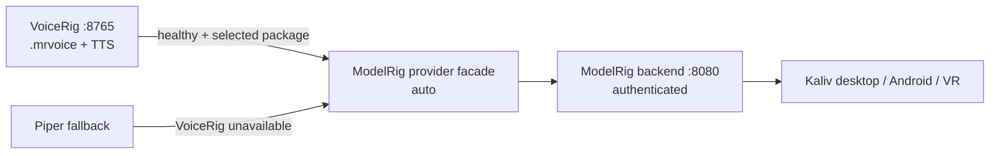

# ModelRig integration contract

_Last reviewed against `main` on 2026-10-01._

## Same-host installation (default)

VoiceRig and ModelRig normally run on the same Windows machine. VoiceRig therefore
installs a completed `.mrvoice` directly into:

```text
~/.kaliv/voices/
```

and atomically writes `default.txt` with the installed package filename. ModelRig
can discover the package at its next synthesis call; ModelRig does not have to be
running while the voice is created.

Override the directory with `MODELRIG_VOICES_DIR`. Set
`MODELRIG_LOCAL_INSTALL=0` to disable the filesystem handoff.

## Remote/API mode

For a future split-host deployment VoiceRig falls back to:

```http
POST /api/v1/voices/import
Content-Type: multipart/form-data
voice=<file.mrvoice>
```

The remote ModelRig endpoint is optional for the primary local deployment.


## Runtime boundary



Kaliv clients do not call VoiceRig directly as their product authority. The
release acceptance checks ModelRig through its authenticated backend and requires
the active provider/package to match the VoiceRig candidate being accepted.
